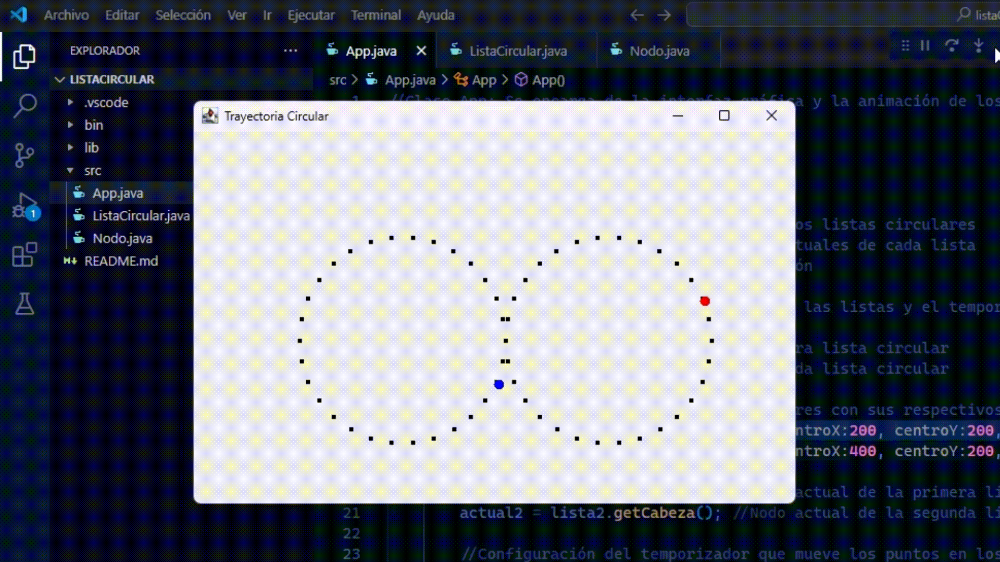

# Listas  Circulares - Entregable #1

Este proyecto es parte del **Entregable #1** de la materia **Lógica de Programación II**, dictada por el profesor **Daniel Agudelo** ([@DanielDev87](https://github.com/DanielDev87)) en el **Tecnológico de Antioquia**.

El objetivo del ejercicio es implementar una **lista enlazada circular** y ver su funcionamiento en una interfaz gráfica utilizando **Java y Swing**.

## Descripción del Proyecto

El programa muestra **dos trayectorias circulares** generadas a partir de listas enlazadas circulares. En cada una de estas, hay un punto animado que recorre los nodos de la lista:

- **Primer círculo**: Su punto animado es de color azul y se mueve en sentido horario.
- **Segundo círculo**: Su punto animado es de color rojo y se mueve en sentido contrario al primer círculo. (Esta es la nueva característica del programa).

## Características
- Implementación de una **lista enlazada circular** en Java.
- Uso de **Swing** para interfa´z gráfica.
- Movimiento en **sentido horario y opuesto** respectivamente en cada círculo.

## 📝 Uso del programa

## Autor
- **Emmanuel Dávila** - Estudiante de Técnica Profesional en Sistemas, Tecnológico de Antioquia.

## ✅ Estado del proyecto

- ✔ Completado para el Entregable #1.
